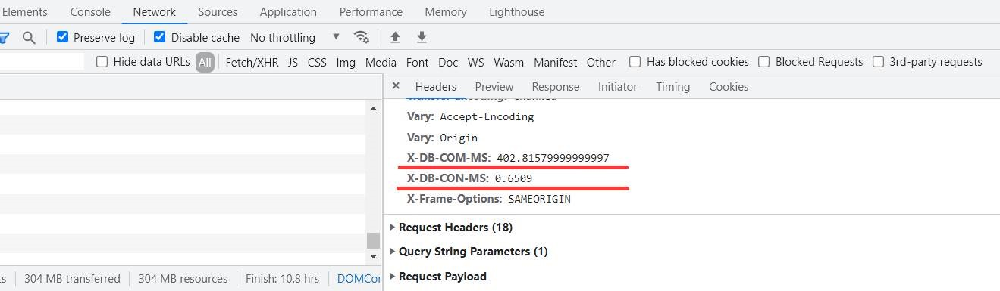

# EF-Duration-Interceptor

[](https://github.com/YulerB/EF-Duration-Interceptor/actions/workflows/dotnet.yml)
[](https://github.com/YulerB/EF-Duration-Interceptor/actions/workflows/codeql-analysis.yml)


Entity Framework Command Duration Interceptor - Outputs as a response header.


To add the interceptor to DbContext call the AddInterceptors method when configuring your DbContext.

```csharp

using EFDurationInterceptor;
...
services
  .AddDbContext<NvmContext>((provider, options) => options
  .UseSqlServer(connectionString)
  .AddInterceptors(provider.GetRequiredService<DurationDbInterceptor>())); 
```

A value is added to the response headers for both the duration setting up connections and the duration executing commands. 


